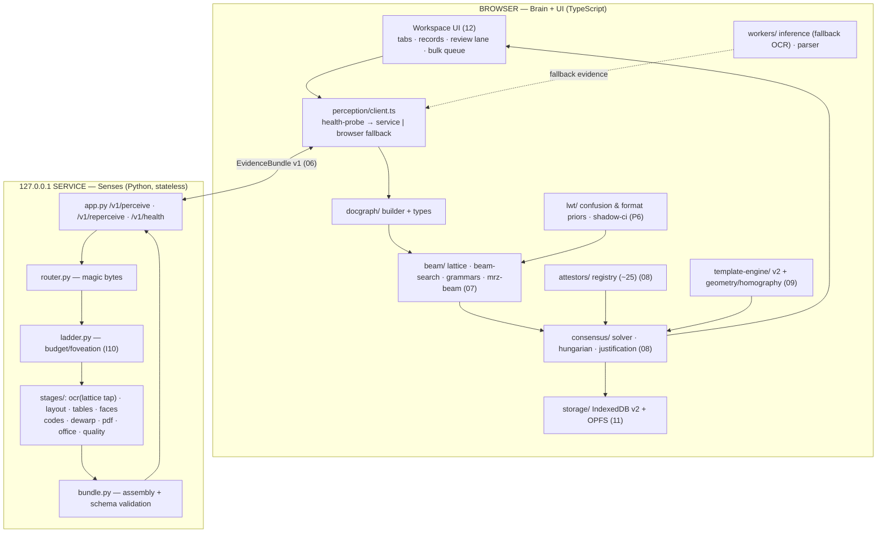

# 02 — Architecture

The complete system shape: one stateless perception service (senses), one TypeScript judgment
core (brain), one frozen contract between them.

---

## 1. The brain/senses split (the load-bearing decision)

- **Senses** — Python 3.11+ FastAPI service on `127.0.0.1`: converts bytes into *evidence*
  (OCR lattices, layout boxes, code payloads, faces, table structures, native cells). Stateless:
  no DB, no sessions, nothing persisted. Swappable and independently testable (bytes → JSON).
- **Brain** — TypeScript in the browser (existing tested core, evolved in place): builds the
  DocGraph, runs beam/grammar decoding, the consensus solver, attestors, templates, priors,
  storage, UI. **All judgment lives here and only here (N7).**
- **Contract** — the Evidence Bundle v1 ([06](06_EVIDENCE_BUNDLE_CONTRACT.md)). The brain never
  knows whether evidence came from the native service, the in-browser fallback pipeline, or a
  digital-file parse — identical shape, one code path.

Why: judgment duplicated across languages is a correctness time bomb; perception duplicated is
merely a quality tier. So perception is allowed two implementations (native = primary, browser =
fallback), judgment exactly one.

## 2. Component map

## 3. Runtime modes

| Mode | Perception | When | Quality |
|---|---|---|---|
| **Hybrid** (primary) | native service | service healthy on `/v1/health` | full: v6 OCR tiers, layout, tables, all file types |
| **Browser-only** (fallback) | in-browser workers (PP-OCRv5 ONNX, zxing-wasm, PDF.js) | service absent/unhealthy | images+PDF only; no layout/tables until service returns; UI shows a capability banner |
| Both modes share the brain, storage, templates, and records — switching modes never touches user data. |

## 4. The unknown-document flow (discovery)

1. Identity check (I13): sha256 exact → perceptual-hash near-dup → template match → unknown.
2. Route by magic bytes ([01 §4](01_PRODUCT_AND_FEATURES.md)); digital truth never OCR'd (I9).
3. Vision ladder (I10): low-DPI full-page pass → layout + OCR + codes + faces → brain builds
   graph → beam/grammar decode → attestors scan → solver assigns → **only unproven ROIs**
   re-perceived at higher DPI (`/v1/reperceive`) until attested or budget spent.
4. Results stream to the UI as they verify (first fields ≤ 1.5 s).
5. Solver output → form; unproven → review lane; approval → template learned + record appended.

## 5. The known-template flow (instant)

1. Identity → family match.
2. Template JIT (I8): compiled plan = ROI crops + grammar/attestor bindings + expected anchors.
3. Homography alignment from text keypoints (I7) → all ROIs batched into **one** recognizer call.
4. Solver verifies (template consistency counts as attestation only alongside per-field proof
   rules, [08 §5](08_CONSENSUS_AND_ATTESTORS.md)) → record appended. Budget: ≤ 1.5 s.
5. Anchor inlier ratio below threshold ⇒ drift → propose new template version, never mutate ([09](09_TEMPLATE_ENGINE.md)).

## 6. Degradation ladders (designed failure, never accidental)

- Alignment: homography → affine → translation+scale (by anchor count/inlier ratio).
- Tables: rulings → SLANet_plus → LORE → x/y clustering; closure check guards all rungs.
- OCR: v6 tier → v5 fallback (config enum); script-specific v5 models for non-Latin.
- Dewarp: none → classical contour+TPS → UVDoc (flag, lazy).
- Perception: service → browser fallback.
- Every rung is pre-chosen (Constitution §6.1); flips are logged config, not decisions.

## 7. Concurrency & processes

- Browser: UI thread (React) + workers (fallback inference, parsing, export). Comlink RPC.
- Service: uvicorn single process, thread pool for ONNX (intra-op threads = cores); one document
  in flight per request; bulk concurrency (2) is managed by the **brain's** queue — the service
  stays dumb and stateless.
- No message buses, no queues-as-infrastructure, no microservices — by discipline ([16](16_ENGINEERING_RULES.md)).

## 8. Directory ownership

See plan.md §12 for the frozen layout. Ownership rule: `service/**` never imports brain concepts
(fields, templates, statuses); `src/**` never parses file formats other than for fallback
perception. The bundle is the only vocabulary both sides speak.
