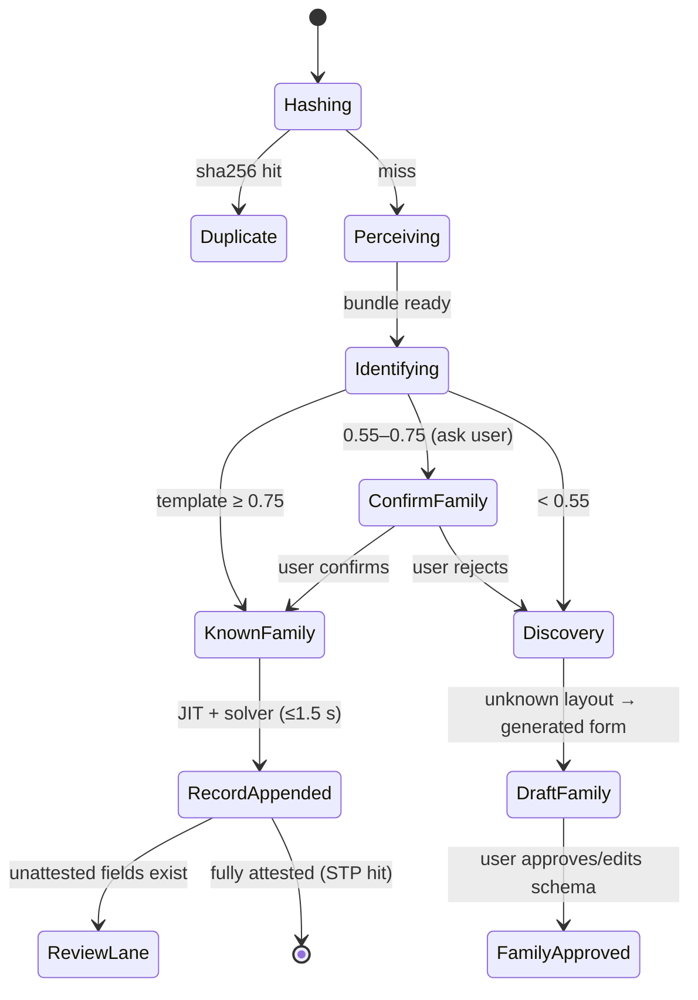

# 11 — Workspace Data Model

Families, records, priors, identity, routing, export — the persistent truth layer. All local:
IndexedDB (structured data) + OPFS (binary assets). Frozen schema: plan.md §14.

---

## 1. Stores (IndexedDB `docgraph-engine-db`, version 2)

v1 stores (`docGraphs`, `templates`, `jobs`) are kept untouched. The v1→v2 migration **adds**
stores and indexes only — no data rewrite (idempotent, tested).

### `families` (key: `familyId`)
```ts
interface Family {
  familyId: string;                  // ulid
  name: string;                      // user-editable
  status: 'active' | 'draft';       // draft = awaiting approval (J4)
  formSchema: FormField[];           // ordered
  templateIds: string[];             // all versions, lineage in template store
  stats: { records: number; stp: number; questionsPerDoc: number };  // rolling
  createdAt: string; updatedAt: string;
}
interface FormField {
  fieldId: string; label: string;
  valueType: 'text'|'date'|'amount'|'enum'|'id'|'email'|'phone'|'photo'|'signature'|'seal'|'table'|'checkbox';
  required: boolean; enumValues?: string[];
  grammar?: string; attestors?: string[]; critical: boolean;
  column: boolean;                   // appears as a records-table column
}
```
Schema edits create a new template version ([09 §2](09_TEMPLATE_ENGINE.md)); removed fields stay
readable in old records (render from stored values, not schema).

### `records` (key: `recordId`; indexes: `familyId`, `sha256`)
```ts
interface DocRecord {
  recordId: string; familyId: string; docGraphId: string;     // full graph retained for replay (I11)
  values: Record<string /*fieldId*/, {
    value: string; status: FieldStatus; justification: Justification;   // (08 §4)
  }>;
  assetRefs: Record<string, string>;         // fieldId → OPFS path
  sourceFile: { name: string; sha256: string; opfsPath: string; kind: SourceKind };
  identity: { phash64: string };             // I13 tier 2
  createdAt: string;
  review: { open: boolean; openFieldIds: string[] };          // the review lane
}
```
**Append-only:** user edits update `values[].status → user_confirmed` with provenance; rows are
never deleted by machine action (user delete = explicit, with confirm).

### `priors` (key: string)
- `'confusion'` → `{ counts: Record<seenChar, Record<trueChar, number>>, total: number }`
  (Laplace-smoothed at read; only checksum-verified reads may write — enforced at the single
  write site).
- `'family:<id>:format'` → `{ dateOrder?: 'DMY'|'MDY'|'YMD'; decimal?: '.'|','; currency?: string }`.

### `benchruns` (key: `runId`; index: `createdAt`)
Shadow-CI replay results: engine version pair, per-record field diffs, verdict ([14 §6](14_QUALITY_TESTING.md)).

## 2. OPFS layout

```text
opfs://
├── models/            (existing browser-fallback model cache)
├── files/<sha256>     (original uploads, content-addressed — dedupe for free)
└── assets/<recordId>/ (portrait.png, signature.png, seal_1.png, …)
```

## 3. Identity tiers (I13) — `src/geometry/phash.ts`

1. **sha256** of bytes (computed at upload): hit in `records.sha256` index ⇒ exact re-upload →
   show existing record, offer "process again anyway". ≤ 0.3 s.
2. **dHash-64** on the normalized page raster: Hamming ≤ 8 ⇒ near-duplicate (rescan of the same
   physical doc) → surfaced as a dedupe suggestion, user decides.
3. **Template match** ([09 §3](09_TEMPLATE_ENGINE.md)) ⇒ family routing.
4. Miss everywhere ⇒ unknown → discovery → draft family.

## 4. Routing state machine (every upload, single code path)


Bulk (F9): a queue of this machine, concurrency 2, per-file isolation — one failure sets that
file's terminal state `failed(reason)` and never touches siblings.

## 5. Draft families (J4)

Generated from discovery output: field candidates ranked by (attested > labeled > repeated),
proposed schema shown with evidence; user may rename/retype/delete fields before approval.
Draft records (processed while awaiting approval) are parked and re-solved on approval. A draft
never appears in exports.

## 6. STP accounting

A record counts as straight-through iff it reached `RecordAppended → [*]` with zero user field
touches and zero questions. `family.stats.stp` = rolling rate; surfaced in the tab header and in
[14](14_QUALITY_TESTING.md) benchmarks. Questions asked are logged per record for the
questions-per-doc metric (I12 target: monotone decline per family).

## 7. Export (F11, client-side only)

- **XLSX** (exceljs): sheet 1 = records × schema columns (`column: true` fields); optional
  provenance block per column (status, attestation kinds, confidence); sheet 2 = export manifest
  (family, template versions, engine version, date). Asset columns hold relative paths.
- **CSV**: values only, RFC 4180.
- **JSON**: full records incl. justification chains (the machine-readable audit).
- **Asset folder**: `export/<family>/<recordId>/…` mirrors OPFS crops + original files (user
  choice). Export is the *only* way data leaves the browser storage — always explicit (N2).
