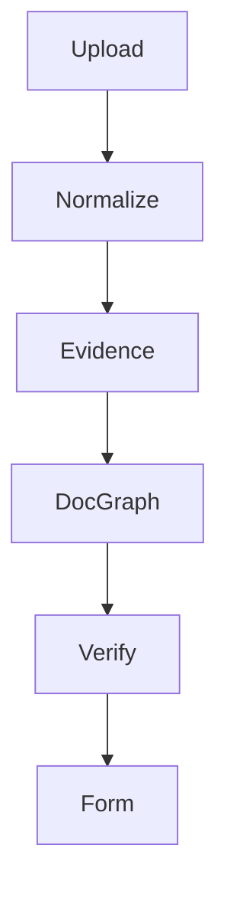

# Documentation Style Guide

**Purpose:** Define how project documentation should be written, structured, reviewed, and kept consistent.

---

## 1. Documentation goal

Docs should allow a capable engineer to build the project correctly.

Every doc should be:

- precise,
- implementation-oriented,
- privacy-aware,
- consistent,
- testable,
- not hype-driven.

---

## 2. Tone

Use:

- direct language,
- clear rules,
- concrete examples,
- explicit warnings,
- honest limitations.

Avoid:

- vague AI marketing,
- “flawless” without constraints,
- unsupported claims,
- hidden assumptions,
- legal guarantees,
- security overclaims.

---

## 3. Standard document structure

Recommended:

```markdown
# Title

**Purpose:** One sentence.

---

## 1. Main concept

...

## 2. Rules

...

## 3. Examples

...

## Final rule

...
```

---

## 4. Use exact terms

Use project terminology consistently:

- DocGraph
- TemplateGraph
- EvidenceRecord
- FieldHypothesis
- Validator
- ValidationResult
- ROI
- Anchor
- Known-template flow
- Unknown-document flow
- Silent error
- Needs review

Do not introduce synonyms unless added to glossary.

---

## 5. Privacy language

Use accurate privacy wording.

Good:

```text
Processed locally by default.
```

```text
No document upload is required for extraction.
```

Avoid:

```text
Impossible to leak.
```

```text
100% secure.
```

```text
Military-grade privacy.
```

---

## 6. Status language

Always preserve uncertainty.

Good:

```text
Extraction complete. 18 confirmed, 3 need review.
```

Bad:

```text
Everything extracted successfully.
```

---

## 7. Code examples

Code examples should be:

- TypeScript when app-facing,
- JSON for schemas,
- Bash for commands,
- valid where possible,
- synthetic and privacy-safe.

Do not include real MRZ, passport numbers, bank data, or signatures.

---

## 8. Tables

Use tables for:

- comparisons,
- checklists,
- class lists,
- version matrices,
- acceptance gates.

Keep long explanations in paragraphs.

---

## 9. Mermaid diagrams

Allowed for architecture/flows.

Example:



Diagrams must not replace detailed text.

---

## 10. Links and references

Use official sources where possible for:

- licenses,
- browser APIs,
- model/runtime docs,
- security guidance.

External factual claims should have source URLs in the doc.

---

## 11. Checklists

Use checklists for release/dev/security steps.

Every checklist should be actionable.

Bad:

```text
- [ ] Make it good
```

Good:

```text
- [ ] No raw OCR text appears in logs
```

---

## 12. File naming

Docs use uppercase descriptive names:

```text
MASTER_PRD.md
MODEL_STACK.md
SILENT_ERROR_RATE.md
```

Schema files use uppercase:

```text
DOCGRAPH_SCHEMA.json
```

---

## 13. Updating docs

When changing behavior, update relevant docs:

- architecture,
- implementation,
- schema,
- testing,
- security/privacy,
- decision log.

No major behavior change should be undocumented.

---

## 14. Review checklist

Before merging docs:

- [ ] terminology consistent
- [ ] no real private data
- [ ] no unsupported claims
- [ ] examples are synthetic
- [ ] paths correct
- [ ] links valid
- [ ] security/privacy wording accurate
- [ ] final rule included where useful

---

## 15. Final documentation rule

Docs are part of the product architecture. If the docs are vague, the implementation will become vague. Write docs that prevent mistakes.
