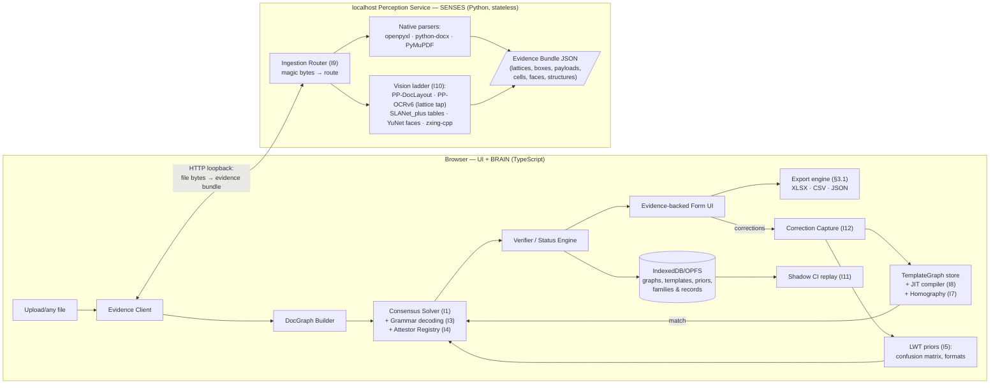

# PLAN.md — The Attestation Engine

**Universal document → form intelligence. Local-only. Zero training. Zero silent errors.**

> Mission: any file in — passport, license, invoice, Excel, deed, anything — fully understood,
> everything extracted (text, photos, signatures, stamps, codes, tables, MRZ), rendered as an
> editable evidence-backed form; user corrects once; every similar document afterward fills
> instantly. Runs on a 4–8 GB laptop with no cloud, no training bill.

---

## 0. Non-negotiable invariants

These are laws, not preferences. Every design decision below is derivable from them.

| # | Invariant | Consequence |
|---|---|---|
| N1 | **Zero silent errors.** A wrong value shown as "confirmed" is the only unforgivable failure. | Extraction must *prove* values, not predict them. Anything unprovable is flagged, never guessed. |
| N2 | **100% local.** No document byte leaves the machine. | All models on disk; loopback-only service; no telemetry. |
| N3 | **$0 training (≤ $30 emergency reserve).** | Pretrained models + deterministic algorithms + statistics only. The reserve is spent only if a measured benchmark gap survives every zero-cost lever. |
| N4 | **4 GB RAM floor.** | Hard memory budget per stage; models lazy-loaded, LRU-evicted; images tiled, never duplicated wholesale. |
| N5 | **No document-type code paths.** | Passports are not special-cased. They *emerge* from universal primitives (MRZ attestor + photo primitive + label/value grammar). Adding "driver's license support" must require zero new code. |
| N6 | **Second upload is instant.** | Template match → compiled extraction plan → one batched inference pass → verified fill, ≤ 2 s. |
| N7 | **Brain in one language.** | All judgment (graph, solver, verifier, templates) stays in the existing tested TypeScript core (303 unit tests). Python is *senses only* — stateless perception. Never duplicate decision logic across languages. |

**Honest definition of "flawless":** no system reads arbitrary damaged paper with 0% error. What *is*
achievable — and what nothing on the market does well — is a system where **every confirmed field
carries a machine-checkable justification**, and everything else asks the user. Wrongness is
converted into a question instead of a lie. That is the product.

---

## 1. The paradigm shift: extraction as proof search, not prediction

Every mainstream document-AI pipeline is built the same way:
`OCR → heuristics/ML → fields → confidence score → hope`.
Confidence is a *feeling* emitted by the same model that made the guess. This is why they all
silently fail.

We invert it. This project's own research corpus ([INNOVATIONS.md](bin/INNOVATIONS.md), [suba.md](bin/suba.md))
already discovered the key idea — *verifiability substitutes for ground truth* — but aimed it at
training data generation. **The groundbreaking move is to relocate that thesis from training-time
to inference-time, where it costs $0 and pays on every single document:**

```
                     ┌─────────────────────────────────────────────┐
    perception  ──►  │  EVIDENCE   (OCR lattices, boxes, payloads) │
                     │     +                                       │
    documents'  ──►  │  CONSTRAINTS (checksums, grammars, arithme- │──► CONSENSUS SOLVER
    own physics      │  tic closure, cross-channel redundancy,     │    max-consistency
                     │  template priors, geometry)                 │    assignment
                     └─────────────────────────────────────────────┘
                                        │
                            every field emerges with a
                          JUSTIFICATION CHAIN or a QUESTION
```

Documents are *full* of self-verification machinery that generic AI ignores:

- **MRZ** carries 4–5 check digits computed over its own content (ICAO 7-3-1).
- **Barcodes/QR** are error-corrected ground truth — a decoded payload is *cryptographically better
  than any OCR read* and frequently repeats the printed fields (boarding passes, GST invoices,
  Swiss/EPC payment QRs, AAMVA driver's licenses in PDF417, UPI QRs).
- **IDs of the world carry checksums**: IBAN (mod-97), credit cards/IMEI (Luhn), Aadhaar (Verhoeff),
  GSTIN, VIN, ISBN/EAN/UPC, NHS numbers, ISIN, IMO numbers…
- **Tables prove themselves**: line items × prices must sum to totals; totals + tax must equal grand total.
- **Layouts prove themselves**: a matched template predicts where every field must be; agreement is attestation.
- **Values have grammars**: a date, an amount, a sex marker, a passport number are tiny formal languages.

A system built to *harvest agreement between independent channels* achieves what a 100× larger
model cannot: **calibrated certainty with zero training**.

---

## 2. Innovation ledger

Each entry: what it is, why it matters, honesty about novelty, cost. These are not decorations —
each one directly attacks a failure mode already observed in this repo's batch tests
([test_screenshots/batch_report.txt](test_screenshots/batch_report.txt)) or a hard requirement above.

### I1 — Consensus Solver: fields as a constraint-satisfaction problem
Instead of a pipeline emitting fields, the DocGraph becomes a lattice of *candidate assignments*
(field → value candidates from OCR top-k, MRZ, barcode payload, template projection). Validators
become *constraints* (hard: checksum must pass; soft: label proximity, format grammar, template
prior). A small deterministic solver picks the **maximum-consistency assignment** and records,
per field, *which constraints attested it*. Disagreement is surfaced as a conflict, never averaged away.
- Kills: the observed MRZ-vs-visual mispairing and label/value drift bugs — globally optimal
  pairing replaces greedy local heuristics (bipartite matching via Hungarian algorithm on
  geometric+lexical cost).
- Novelty: constraint-based extraction exists in academia; **shipping it as the core of a local,
  training-free engine is genuinely new**. No mainstream OSS tool works this way.
- Cost: pure TypeScript. Zero models.

### I2 — Checksum-guided beam decoding (the MRZ killer feature)
Today the code OCRs the MRZ, then *checks* digits and reports `invalid` (the #1 observed failure:
"TD3 status invalid" across the batch run). Backwards. The check digits should **drive the decoder**:
keep per-character OCR probability distributions (CTC lattice), then beam-search the character
space *subject to* all check digits passing and the ICAO grammar (name charset, date ranges, sex ∈
{M,F,<}). A physically readable MRZ with a few ambiguous glyphs (`0/O`, `8/B`, `1/I`, `5/S`, `<`)
becomes deterministically recoverable — with proof, because the checksums pass over the *entire* line.
- Same principle generalizes to *any* checksummed token (I4): decode IBANs, VINs, Aadhaar under
  their own checksum constraint.
- Novelty: commercial passport SDKs do a weak version; **no open local-first engine does
  lattice-level checksum-constrained decoding**. This alone can take MRZ read rate from
  "often invalid" to near-ceiling on legible scans.
- Cost: needs the recognizer's per-step probabilities (already computable — `decodeCTCGreedy`
  in [src/ai-runtime/ocr.ts](src/ai-runtime/ocr.ts) discards them today) + a beam search. Zero models.

### I3 — Grammar-constrained lattice re-decoding for every typed field
The observed `sex = "c/call"` absurdity is a *class* of bug: taking OCR top-1 text and validating
after. For any field whose type is known (from label match, template, or attestor), re-decode the
OCR lattice against the field's **finite-state grammar** (dates in all orderings, amounts with
currency, document numbers, enum fields). The decoder picks the highest-probability path *that is
valid*, or reports "nothing valid in lattice" → question.
- This is I2 without checksums — weighted-FST-style rescoring, tiny and deterministic.
- Kills: sex-field garbage, date misreads, amount `1,000`/`1.000` confusion (grammar carries
  locale hypotheses that the Consensus Solver resolves document-globally — one decision fixes
  every date on the page).
- Cost: TypeScript. Zero models.

### I4 — The Attestor Registry: the world's checksums as a plugin table
One flat registry of ~25 deterministic attestors, each: `pattern → verify(chars) → semantic tags`.
Luhn, IBAN mod-97, Verhoeff (Aadhaar), MRZ 7-3-1, GSTIN, PAN format, VIN (ISO 3779), ISBN-10/13,
EAN-8/13/UPC, ISIN, IMO, NHS mod-11, SSN structure, IMEI, credit-card IIN ranges, date validity,
currency arithmetic. Every OCR token stream is scanned; any hit **self-labels the field**
(a Verhoeff-valid 12-digit → "Aadhaar number, verified") with zero document-type code — this is
how N5 ("expect anything") is honored: documents *announce their own fields* through their checksums.
- Novelty: individually all known; **as a universal self-labeling layer replacing document-type
  templates, it's a real architectural differentiator.**
- Cost: pure TypeScript table + tests. Zero models.

### I5 — Learning Without Training: the engine measurably improves, $0, no gradients
Three compounding local feedback loops, none of which touch a neural weight:
1. **Confusion prior**: every checksum-verified read (I2/I4) yields *free ground truth* for what
   the OCR actually saw vs. what was printed → maintain a per-installation character-confusion
   matrix → it re-weights all future lattice decoding (I2/I3). The engine literally adapts to
   *your* scanner/camera, using math instead of fine-tuning.
2. **Format priors per template family**: user resolves "DD/MM vs MM/DD" once → stored on the
   template → never asked again.
3. **Template flywheel** (already designed in [bin/docs/](bin/docs/README.md)): corrections → TemplateGraph
   → next document of that family skips discovery entirely.
- Novelty: confusion-matrix adaptation from *checksum-verified* reads (not human labels) appears
  to be **genuinely novel in shipping products**. It is the project's "verifiability = ground truth"
  thesis eating its own tail — at runtime.
- Cost: a JSON matrix in IndexedDB. Zero models.

### I6 — Dual-channel perception quorum for critical fields
N-version programming applied to OCR: critical fields (money, IDs, dates feeding decisions) are
read through **two decorrelated channels** — e.g., raw crop vs. binarized+deskewed crop, or PP-OCRv5
server vs. mobile recognizer. Auto-confirm requires agreement; disagreement → review. Decorrelated
errors almost never coincide on the same wrong string, so agreement ≈ proof.
- Where channels exist naturally (MRZ ↔ visual zone ↔ barcode payload), quorum is free (I1 handles it).
  This innovation manufactures a second channel when only one exists.
- Cost: 2× inference *only* on critical unverified ROIs (small crops — milliseconds each).

### I7 — Text-as-keypoints homography
Template alignment today is naive translation+scale (a known weakness). Replace with: OCR word
boxes *are* a dense keypoint set — match template↔instance words by string equality + mutual
geometric consistency, then RANSAC a full homography over centroid correspondences. Words are
better than SIFT for documents: abundant, discriminative, already computed.
- Kills: template refill drift under rotation/perspective/scale; enables aggressive ROI-first
  extraction with tight crops.
- Novelty: known in document-forensics literature, absent from OSS extraction engines.
- Cost: ~200 lines TS (RANSAC + DLT). Zero models.

### I8 — Template JIT: compile templates into extraction programs
On template match, don't *interpret* the TemplateGraph — **compile** it: an ordered plan of
(ROI crop → expected grammar → attestors → target field), all ROI crops batched into a single
recognizer inference call, validators pre-bound. Discovery, layout analysis, classification all
skipped. This is how "second upload = instant" is engineered rather than hoped for: the known-template
path executes a *specialized program*, not a general pipeline.
- Target: ≤ 1.5 s CPU-only for a 10-field template (measured budget in §6).
- Cost: TypeScript compiler pass over existing TemplateGraph. Zero models.

### I9 — "Never OCR digital truth" — the universal ingestion router
"Any extension" is not an OCR problem; it's a routing problem. Magic-bytes sniffing (never trust
extensions) routes:
- **XLSX/XLS/CSV/ODS** → native cell parse (values + formulas + formats — *perfect* extraction, OCR literally cannot compete)
- **DOCX/ODT** → native XML parse (runs, tables, embedded images — images recurse through the vision path)
- **Digital PDF** → text layer + vector info via PDF parser
- **Scanned PDF** → rasterize → vision path
- **Hybrid PDF** → *both*, reconciled: text layer claims are verified against the render (catches
  the classic scanned-PDF-with-garbage-OCR-layer trap; disagreement → vision wins + flag)
- **Images (JPEG/PNG/WebP/TIFF/HEIC/BMP)** → vision path
- Every route emits the **same evidence-bundle shape** — the brain never knows or cares about file types.
- Cost: openpyxl + python-docx + PyMuPDF in the perception service. All Apache/BSD-class licenses.

### I10 — Anytime extraction under a deadline scheduler (the 4 GB weapon)
Perception runs as an escalation ladder with an explicit compute budget:
low-DPI full-page pass → layout + cheap OCR → solver attempt → **only ROIs that failed
verification** get re-perceived at higher DPI (foveation), repeat until attested or budget spent.
Results *stream*: verified fields appear in the UI within ~1 s while stragglers refine.
Memory follows the same law — full-res image is memory-mapped and tiled; only foveated crops
materialize at high resolution.
- Kills: the 4 GB constraint and the "instant feel" requirement simultaneously; compute is spent
  exactly where proof is missing.
- Cost: scheduler logic. Zero models.

### I11 — Corrections as a permanent personal regression suite
Every user correction is already stored locally. Turn the archive into a **shadow CI**: on every
app/model/prompt-free-logic update, silently replay all archived documents through the new engine
and diff field outcomes against user-confirmed truth. Regressions block the update with a report.
The user's own history becomes their guarantee that the tool only ever gets better *for them*.
- Novelty: personal, local, automatic regression testing of an extraction engine appears to be
  **unique**. It also operationalizes N1 forever.
- Cost: a replay runner over existing stored graphs.

### I12 — Information-gain correction UX ("ask least, learn most")
When verification fails, don't dump 14 red boxes on the user. Rank open questions by how many
downstream uncertainties each answer collapses (date-format question resolves *every* date;
one label confirmation may anchor the whole template). Ask the top 1–3. Wizard feel, minimal labor,
and each answer feeds I5's priors.
- Cost: ranking heuristic over the solver's constraint graph.

### I13 — Three-tier document identity
Perceptual hash (exact re-upload — answer instantly from stored graph) → layout fingerprint +
anchor match (same *family* → Template JIT) → unknown (full discovery). Cheap, instant, and it
makes the demo moment — drop the same passport twice — feel like magic. Powers the workspace
auto-routing loop (§3.1): match → instant fill + record; no match → draft-family proposal.

### I14 — Render-and-compare tripwire *(experimental, Phase 6)*
For accepted critical fields, re-render the value and compare against the source crop
(feature-level similarity) as a final wrong-accept tripwire. The shipping variant is I6 (quorum);
this stays a research toggle until it proves signal on the personal benchmark. Marked honestly:
promising, unproven.

---

## 3. System architecture

**Brain/senses split.** All judgment stays in the existing TypeScript core — evolved, not rewritten
(it already has the DocGraph, verifier, template engine, and 303 passing unit tests). Perception
moves to a stateless local Python service for native-speed, full-quality models and native file
parsing. The browser pipeline remains as a degraded fallback when the service isn't running.



**Why stateless perception is the right amount of engineering:** no session state, no DB in the
service, no sync problems; trivially testable (bytes in → JSON out); swappable (browser-only
fallback uses the same evidence-bundle contract); private by construction (loopback bind, nothing
persisted server-side).

### 3.1 Workspace model — families, records, tabs (the confirmed product surface)

The UI is organized around **document families**, shown as tabs — not single documents:

- **Family** (tab) = approved form schema + learned TemplateGraph versions + a growing **records table**.
- **Record** = one processed document as a row: field values, statuses, evidence links, asset crops
  (photo/signature files), source-file reference. Every successful extraction appends one.
- **Auto-routing on upload** (I13): exact re-upload → dedupe notice; matches a family → Template JIT
  fill → record appended (rows auto-confirm only when fully attested; anything else lands in the
  family's review lane); matches nothing → the engine studies it, proposes a **draft family** with a
  generated form, and waits for user approval/customization before it becomes a tab.
  Wrong-document-into-wrong-tab is impossible by construction: routing is by document identity,
  not by which tab happens to be open.
- **Bulk ingestion**: drop N files at once (images/PDFs mixed) → per-file queue, concurrency-capped,
  failures isolated per file, results streaming into the records table live.
- **Export**: any family's records → **XLSX / CSV / JSON** (exceljs, MIT, client-side — stays local),
  with optional provenance columns (status, confidence, justification); asset crops export as files.
- **Manual control**: create/rename/merge families and edit form schemas anytime; schema edits create
  a new template version — old records are never rewritten (append-only truth).

The improvement loops (I5, I8, I11, I12) exist to drive each family's **straight-through rate**
upward — the product's north-star KPI, defined in §7.

**The evidence-bundle contract** (the single seam between worlds — versioned, schema-validated):

```jsonc
{
  "bundleVersion": 1,
  "source": { "kind": "image|pdf_digital|pdf_scanned|xlsx|docx|csv", "pages": 1 },
  "pages": [{
    "geometry": { "wPx": 3060, "hPx": 2040, "deskewDeg": -1.2, "quality": { "blur": 0.1, "glare": 0.02 } },
    "ocr": [{ "poly": [...], "top1": "PASSPORT", "lattice": [[["P",0.99],["F",0.01]], ...], "rot": 0 }],
    "layout": [{ "cls": "table|figure|title|plain_text|...", "box": [...], "conf": 0.93 }],
    "codes":  [{ "format": "PDF417", "payload": "...", "box": [...] }],
    "faces":  [{ "box": [...], "landmarks5": [...], "conf": 0.99 }],
    "tables": [{ "box": [...], "cells": [{ "r":0,"c":0,"rs":1,"cs":1,"box":[...] }] }],
    "native": { "cells": [...], "textRuns": [...] }   // digital-file routes only
  }]
}
```

The `lattice` field (top-k per character step) is the deliberate departure from every off-the-shelf
OCR wrapper — it is what makes I2/I3/I5 possible.

---

## 4. The model arsenal — FINAL SELECTION (locked 2026-07-06)

Selection process: 6 independent deep-research reports (`bin/Research MSel/`) cross-examined against
each other, then every disputed or novel claim verified against primary sources (GitHub releases,
PyPI, model cards) before adoption. Consensus votes and verification notes per slot below.

| Slot | **Selected** | Size / CPU | License | Why (and who agreed) |
|---|---|---|---|---|
| OCR det+rec | **PP-OCRv6** (small tier default, tiny for ultra-low, medium for 8 GB) via RapidOCR/direct ONNX — **PP-OCRv5 pinned as tested fallback** until our own passport gate passes on v6 | tiny 1.5M / small 7.7M / medium 34.5M params; ≤5.2× CPU speedup vs v5 | Apache-2.0 | **Verified by me**: released in PaddleOCR v3.7.0 (2026-06-11); RapidOCR v3.9.1 ships it; still CTC → lattice access preserved. 3/6 reports (grk-w, fble-c; op48 pre-dated it) — strict upgrade, same family, same lattice path. Vendor benchmarks → gated on our MIDV/passport batch before lock. Non-Latin scripts (Cyrillic/Arabic/Devanagari…) ride PP-OCRv5 script-specific 2M-param models, hot-swapped per detected script. Browser fallback stays PP-OCRv5 (already deployed). |
| Layout | **PP-DocLayout-S** (4 GB) / **-M** (8 GB) — primary. **DocLayout-YOLO demoted to A/B challenger** in the Phase 4 spike | S: 4.8 MB, ~15 ms CPU; M: 22.6 MB, ~50 ms | **Apache-2.0** | 5/6 reports converged on the flip (license + size + speed + maintenance + official ONNX in PaddleOCR 3.x). Killer feature: **23 classes including `seal`** — stamps get boxes for free, seeding §5.3. DocLayout-YOLO is AGPL and its repo is dormant; it stays only as accuracy challenger on our own degraded-photo bench. |
| Table structure | **SLANet_plus** (via RapidTable) | 6.8–7.4 MB, ~40 ms | Apache-2.0 | Unanimous keep (5/5 relevant). Neutral RapidAI TEDS bench: 0.845 @ 6.8 MB vs unitable 0.862 @ 500 MB (disqualified). SLANeXt is ~350 MB — rejected. Fallback ladder: classical ruling-lines → `lineless_table_rec` (LORE, Apache-2.0) → x/y-clustering. |
| Faces | **YuNet** (OpenCV Zoo) | 0.3 MB, single-digit ms | MIT | Unanimous keep. SCRFD disqualified (non-commercial weights); MediaPipe/RetinaFace overkill. "Optimal, don't touch" — every report. |
| Barcodes | **zxing-cpp** (official Python wheel) | ~2 MB | Apache-2.0 | Unanimous keep. v3.x active (MicroPDF417 improvements days old); covers QR/rMQR/PDF417(AAMVA)/Aztec/DataMatrix/all-1D. No alternative covers the format list. |
| Digital PDF | **pypdfium2** — one library for text-layer extraction *and* rasterization | — | Apache-2.0/BSD | My correction to the research: gmni proposed `pdf_oxide` (verified real, MIT, fast) but it **cannot rasterize pages** — the scanned-PDF route needs rendering; it's also beta w/ single maintainer. pypdfium2 = Chrome's PDFium, mature, does both jobs. PyMuPDF **dropped** (AGPL, now unnecessary). pdf_oxide stays on the watch-list for text-span extraction only. |
| Office files | **openpyxl · python-docx** | — | MIT | Unanimous, boring, correct. |
| Dewarping | **Classical-first** (page contour + text-line TPS). **UVDoc** as gated lazy-load add-on via `rapid-undistorted` (ONNX packaged) only if classical fails on measured crumpled-capture set | UVDoc ~8–30 MB | reported MIT/Apache — **confirm at integration** | 3 reports converge on UVDoc as the only CPU/ONNX-practical neural dewarper (grid-regression output — no generative pixel invention, so checksum-safe). Not resident by default. |
| Handwriting | **None — slot closed.** PP-OCRv5/v6 handle printed-form handwriting natively through the same CTC lattice path | 0 MB | — | Unanimous. TrOCR rejected: autoregressive → no lattice → can never be attested. |
| Stamp/seal/signature masks | **None — classical only**, seeded by PP-DocLayout `seal` boxes (HSV chroma gate + adaptive threshold + stroke-width) | 0 MB | — | gmni's YOLO-nano signature model rejected: needs training (violates $0) / AGPL; tech4humans detector rejected on verification (AGPL + gated repo). |

Discarded research input: `gpt.txt` (off-topic — generic research-topics report, tool misfired).
All license/size/existence claims above re-verified by me on 2026-07-06; *relative accuracy* claims
(v6 deltas, PP-DocLayout mAP) are vendor-published and therefore gated by our own benchmarks before
each switch locks — every swap is a config enum behind the evidence-bundle contract, fully reversible.

Kept from current repo: PP-OCRv5 browser ONNX path (fallback mode), zxing-wasm (fallback),
the whole TS brain. **Frozen**: the custom YOLO training pipeline (`training/`, `kaggle_*` — it cost
weeks, failed its own 0.90 recall gate at 0.82, and pretrained layout models make it unnecessary).

---

## 5. Subsystem deep dives

### 5.1 Perception service
FastAPI, binds `127.0.0.1` only. One endpoint that matters: `POST /perceive` (bytes + budget hints →
evidence bundle). Models lazy-load on first use, LRU-evict under memory pressure (N4). Each vision
stage is a pure function; the ladder (I10) orchestrates. Model files vendored under `service/models/`
with a fetch script mirroring the existing [scripts/fetch-models.mjs](scripts/fetch-models.mjs) pattern.
Config picks profile: `lite` (4 GB: PP-OCRv6-tiny/small + PP-DocLayout-S) / `full` (8 GB+:
PP-OCRv6-medium + PP-DocLayout-M). **Lattice tap**: the service runs the recognizer ONNX directly
and reads the raw T×C softmax tensor before argmax/collapse — RapidOCR's convenience API returns
only strings, so it serves as model loader/reference, not the decode path.

### 5.2 OCR lattice + grammar engine (I2/I3)
- Modify recognition post-processing to keep top-k(=5) chars per CTC step *before* collapse.
- Grammar automata as plain TS: `DATE(locale-set)`, `AMOUNT(locale-set)`, `ENUM(...)`,
  `MRZ_TD1/2/3`, `ID(pattern, attestor)`. Beam search (width ~50) over lattice × automaton,
  confusion-prior (I5) re-weighted.
- MRZ specifically: joint decode over the *whole zone* (2–3 lines), all check digits as hard
  constraints, `<` filler geometry-aware. Success criterion is brutal and honest: checksums pass
  over the decoded text or the MRZ is *not* claimed.

### 5.3 Visual asset extraction (the "perfect crop" requirement)
- **Portrait**: YuNet face box + landmarks → rotate to level eyes (roll), expand to standard
  portrait ratio (head-to-chin ~70% of height), snap to detected photo-region edges
  (gradient/rectangle fit), output clean PNG. Deterministic, explainable, ~0.3 MB of model.
- **Signature**: region (layout class or template ROI) → adaptive threshold → stroke-width filter
  (keeps thin ink, drops print) → largest connected stroke cluster → tight crop + transparent
  background PNG.
- **Stamps/seals**: circular/elliptical Hough + color segregation (stamps are usually chromatic
  outliers) → crop + mask. Overlapping-text tolerant.
- Every asset carries evidence provenance like any field (N1 applies to pixels too).

### 5.4 Table engine (arithmetic closure as acceptance)
1. Ruled tables: morphological line extraction → grid intersection → cells (OpenCV, deterministic).
2. Borderless: SLANet_plus structure prediction (Phase 4 spike decides if it earns its place;
   fallback ladder: `lineless_table_rec` (LORE, Apache-2.0, ONNX) → x/y-cluster alignment of OCR
   boxes — solid classical method).
3. Cells OCR'd via foveated re-read; numeric columns get grammar decoding (I3).
4. **Closure check**: Σ(line totals) ≈ subtotal, subtotal+tax ≈ total, qty×unit ≈ line. Closure
   passing ⇒ the whole table self-attests (I1 treats it as one big constraint). Failing cells are
   *located* by which sum breaks — the solver can even auto-repair a single-cell error if exactly
   one repair satisfies all sums, else asks.

### 5.5 Template engine v2 (I7 + I8 + versioning)
- Match: existing fingerprint scoring, hardened by anchor-set mutual-consistency.
- Align: text-keypoint RANSAC homography; degrade gracefully to affine/translation when <4 anchors.
- Extract: JIT plan; single batched rec call for all ROIs; per-field grammar+attestors pre-bound.
- Drift: anchor inlier ratio < threshold ⇒ propose new template *version* (never silently mutate —
  rule already specified in [bin/docs/06_TEMPLATE_ENGINE/TEMPLATE_CORRUPTION_PREVENTION.md](bin/docs/06_TEMPLATE_ENGINE/TEMPLATE_CORRUPTION_PREVENTION.md)).

### 5.6 Consensus solver & verifier v2 (I1)
- Candidates per field: OCR top-k, grammar re-decodes, MRZ decode, barcode payload parse,
  template projection, native-file cells.
- Hard constraints: attestor checksums, grammar validity, geometric containment.
- Soft constraints (weighted): label-affinity (Hungarian pairing), template prior, confusion-prior
  likelihood, quorum agreement (I6), cross-field rules (expiry > issue, DOB sanity, MRZ↔VIZ equality).
- Output statuses (existing enum kept): `confirmed` *only* when ≥1 hard attestation or
  quorum agreement; else `needs_review`/`conflict`/`invalid`/`missing`. This formalizes N1 as code.
- Scale honesty: tens of fields × ≤10 candidates — exact solve or tiny branch-and-bound, milliseconds.
  No SAT-solver dependency. `// note: exhaustive over ≤10 candidates/field is fine at document scale`

### 5.7 The LWT store (I5)
IndexedDB objects: `confusionMatrix` (char×char counts from checksum-verified reads, Laplace-smoothed),
`formatPriors` (per template-family locale decisions), both consulted by the grammar engine.
Strictly additive statistics — no weights, no drift risk, fully inspectable by the user.

---

## 6. Performance & memory engineering (the 4 GB proof)

| Stage | Budget (lite profile) | Mechanism |
|---|---|---|
| Service resident | ≤ 450 MB (actual stack ~60 MB models / <200 MB resident) | PP-OCRv6-small det+rec (~20 MB) + PP-DocLayout-S (4.8 MB) + SLANet_plus (7 MB) + YuNet (0.3 MB) + ORT runtime; UVDoc lazy; LRU eviction |
| Peak per document | ≤ +500 MB | page rasterized ≤ 2200 px long side for discovery; full-res kept on disk, foveated crops only (I10) |
| Browser (brain+UI) | ≤ 600 MB | graphs are KB-scale; crops as blobs in OPFS not RAM |
| Unknown document E2E (4-core CPU) | ≤ 8 s to full verified form; first verified fields ≤ 1.5 s (streaming, I10) | ladder + batched inference |
| Known template (I8) | **≤ 1.5 s** | JIT plan, one batched rec pass |
| Exact re-upload (I13) | ≤ 0.3 s | perceptual-hash hit → stored graph |

Every number above becomes an automated performance test in Phase 7 — they are commitments, not vibes.

---

## 7. Quality doctrine

- **The one metric that rules**: critical silent-error count = 0 on every benchmark run
  (already codified in [bin/docs/12_TESTING_BENCHMARKS](bin/docs/12_TESTING_BENCHMARKS) — we inherit it).
- **North-star product KPI: straight-through rate (STP)** — the % of uploads per family processed
  with *zero* human touches. Every loop in this plan (template flywheel I8, priors I5, smarter/fewer
  questions I12, regression shield I11) exists to push STP → 100% per stable family. Honest asymptote,
  per N1: fully attestable documents reach true 100% hands-off; physically unprovable ones (destroyed
  scans) get a question instead of a lie — forever, by design.
- **Benchmarks**: (a) the 20 real images in [passport_images/](passport_images) as the passport gate;
  (b) a growing mixed corpus (invoices w/ QR, Aadhaar/PAN samples, spreadsheets, DOCX, hybrid PDFs);
  (c) the user's own corrected archive via Shadow CI (I11) — the benchmark that grows itself.
- **Per-phase gates** are defined in §8; no phase closes without its gate green.
- **Unit discipline**: solver, grammars, attestors, homography, MRZ beam decoder are pure functions —
  they get the dense test treatment the existing 303-test suite already models.

---

## 8. Execution roadmap — sequenced for fastest falsification

Each phase: goal → riskiest assumption attacked first → definition of done (observable).

### Phase 1 — Passport E2E perfection *(current browser app; no backend yet)*
The existing failures are brain-side, so fixing them now is 100% preserved investment (N7).
1. Expose CTC lattices from the existing recognizer (smallest change with the biggest unlock).
2. MRZ checksum-guided beam decode (I2) — *replaces* parse-then-validate.
3. Grammar decoding for sex/dates/document-number (I3) + Hungarian label-value pairing (I1-lite).
4. YuNet in the existing worker → real portrait crop (§5.3); signature ink extraction.
5. Text-keypoint homography (I7) + Template JIT-lite → hardened instant refill.
- **Gate**: on [passport_images/](passport_images): MRZ valid parse on 100% of physically legible
  MRZs; zero silent errors; zero garbage fields (the "c/call" class extinct); template re-upload
  fills in ≤ 2 s with all MRZ-attested fields confirmed. Falsifies-or-proves: I2/I3 (the plan's heart).

### Phase 2 — Workspace: families, tabs, records, bulk & export (§3.1)
The confirmed usage loop becomes product surface: family tabs, per-family records table, bulk
upload queue (images + PDFs — PDF.js text-layer/raster interim until the service route in Phase 3),
auto-routing with draft-family proposals (I13), XLSX/CSV/JSON export (exceljs, client-side).
- **Gate**: bulk-drop all 20 passport images → one family tab with 20 records, review lane holding
  only unattested fields; uploading an invoice into the same workspace spawns a *draft* family
  awaiting approval (zero pollution of the passport family); XLSX export opens clean in Excel with
  values + provenance columns and asset crops alongside.

### Phase 3 — Perception service + universal ingestion (I9)
FastAPI skeleton → evidence-bundle contract → **week-one lattice-tap prototype** (run PP-OCRv6 rec
ONNX directly, verify raw T×C tensor extraction — the plan's most load-bearing service assumption)
→ v6-vs-v5 A/B on the passport gate before v6 locks → router for
XLSX/DOCX/CSV/PDF(digital/scanned/hybrid via pypdfium2) → brain consumes bundles (browser pipeline
demoted to fallback).
- **Gate**: same passport results through the service but faster; an XLSX and a digital PDF extract
  *perfectly* (cell-exact) with zero OCR invoked; hybrid-PDF reconciliation catches a planted
  garbage text layer.

### Phase 4 — Universal vision (layout + tables + codes)
PP-DocLayout-S/M wired as primary layout (the `LAYOUT_MODEL` slot in
[src/ai-runtime/model-registry.ts](src/ai-runtime/model-registry.ts) has been waiting for exactly
this) with DocLayout-YOLO as A/B challenger on our degraded-photo bench; `seal` boxes seed the
stamp pipeline; zxing-cpp native; table engine with closure checks (§5.4); SLANet_plus spike decision.
- **Gate**: invoice corpus — line-item tables reconstructed with arithmetic closure passing on
  clean scans; QR/PDF417 payload cross-attestation works (a GST/EPC QR confirms printed totals).

### Phase 5 — Full Consensus Solver + Attestor Registry (I1 + I4 complete)
Solver replaces the linear verify pass; ~25 attestors land with exhaustive unit tests;
quorum channel (I6) for critical unattested fields; anytime scheduler (I10) across the ladder.
- **Gate**: mixed-corpus run where every confirmed field carries a printable justification chain;
  document-type-agnostic test — an unseen doc type (e.g., vehicle registration) yields
  self-labeled attested fields with zero code added (N5 proven).

### Phase 6 — Learning Without Training + personal Shadow CI (I5 + I11 + I12)
Confusion priors live; format priors; info-gain question ranking;
correction-archive replay runner blocking regressions. I14 lands behind a flag.
- **Gate**: measurable — re-running the Phase-1 benchmark with priors warmed shows equal-or-better
  field accuracy with fewer questions asked; a deliberately-regressed build is *caught* by Shadow CI.

### Phase 7 — Hardening & packaging
Performance commitments of §6 turned into CI tests on a throttled 4 GB VM profile; one-command
self-host install (`pip install` + static UI, or single Docker); *then* the deferred security pass
(encryption-at-rest, service auth token, threat model from [bin/docs/11_SECURITY_PRIVACY](bin/docs/11_SECURITY_PRIVACY)) — per your explicit instruction, last.

Budget across all phases: **$0 spent**; the $30 reserve remains untouched unless a Phase-4/5 gate
fails in a way that only a micro-fine-tune can fix (decision requires benchmark evidence, per N3).

---

## 9. Pre-mortem — how this plan fails, and the counters

| Risk | Likelihood | Counter |
|---|---|---|
| Raw lattice extraction from PP-OCRv6 ONNX (RapidOCR's API returns strings only) | **confirmed caveat** | service runs the rec model directly and reads the T×C tensor pre-argmax — week-one Phase 3 prototype; browser path already owns the tensor in [src/ai-runtime/ocr.ts](src/ai-runtime/ocr.ts) |
| PP-OCRv6 accuracy deltas are vendor-published; RapidOCR v6 integration is weeks old | medium | v5 pinned as tested fallback; v6 locks only after our own passport batch gate passes; swap is a config enum |
| PP-DocLayout classes miss signature regions (has `seal`, no `signature`) | medium | signatures come from §5.3 classical ink extraction inside layout-proposed + template ROIs — the layout net only *proposes regions* |
| SLANet_plus underwhelms on wild invoices | medium | fallback ladder already designed (ruling-lines → LORE → alignment clustering); closure check (§5.4) protects correctness either way |
| Beam decode too slow in TS for big lattices | low | MRZ = 88 chars × k=5 — trivial; general fields are shorter; budget-capped beams |
| Homography unstable on sparse-text docs | low | graceful degradation ladder affine→translation already specified |
| Scope explosion ("any document in the world") | **high** | N5 discipline: universality comes only from primitives+attestors; any "just add a special case for X" PR is rejected by design; phase gates keep focus |
| 4 GB target slips | medium | §6 budgets are tested in CI from Phase 7; lite profile is default |

## 10. What we deliberately do NOT build (engineering discipline)

- ❌ Any LLM/VLM runtime — violates N2/N4, adds hallucination risk that N1 exists to kill.
- ❌ Custom model training pipelines (frozen; archived) — N3.
- ❌ Microservices, queues, orchestrators — one stateless service is the correct size.
- ❌ Per-document-type extraction modules — N5; the attestor/grammar/primitive trio *is* the mechanism.
- ❌ A plugin architecture before a second consumer exists.
- ❌ Cloud sync, accounts, marketplaces — non-goals per [bin/docs/01_PRODUCT/NON_GOALS.md](bin/docs/01_PRODUCT/NON_GOALS.md).
- ❌ Security theater *now* — deferred to Phase 7 by explicit owner decision (noted: until then,
  builds are dev-trust-only).

## 11. Immediate next actions (Phase 1 kickoff)

1. Expose CTC top-k lattice from [src/ai-runtime/ocr.ts](src/ai-runtime/ocr.ts) (keep `decodeCTCGreedy` for fallback).
2. Build `src/parsers/mrz-beam.ts` — checksum-constrained MRZ lattice decoder + dense unit tests
   (synthetic corruption suite: every confusable-glyph class).
3. Wire it into the MRZ path in [src/App.tsx](src/App.tsx) / [src/docgraph/mrz-fields.ts](src/docgraph/mrz-fields.ts).
4. Run the puppeteer batch suite against [passport_images/](passport_images); measure MRZ valid-parse
   delta vs. the current batch report — the plan's first falsification test.

---

*This plan is grounded in: the full repo study (docs/, src/, training/, test artifacts), the
verified availability and licenses of every external model named (fetched 2026-07-06), and the
owner's confirmed constraints. Its single load-bearing bet — that document self-verification can
replace model scale — is tested first, in Phase 1, on real passports, before anything else is built.*

---
---

# PART II — EXECUTION WORKBOOK

*Part I decided **what and why**. Part II pins **exactly how** — contracts, schemas, layout, and
per-phase task lists with done-criteria — so development is pure flow. The change-control rule
(§18) defines the only legal way this document changes after dev starts.*

## 12. Target repository layout

```text
docutract/
├── plan.md                     ← this file (the law)
├── src/                        ← BRAIN + UI (TypeScript, evolves in place)
│   ├── ai-runtime/             ← browser fallback perception (kept)
│   ├── attestors/              ← NEW Phase 5: registry.ts + one file per attestor + tests
│   ├── beam/                   ← NEW Phase 1: lattice.ts, beam-search.ts, grammars/, mrz-beam.ts
│   ├── consensus/              ← NEW Phase 5: solver.ts, hungarian.ts, justification.ts
│   ├── components/             ← UI; Phase 2 adds workspace/ (FamilyTabs, RecordsTable,
│   │                              BulkQueue, DraftFamilyReview, ExportDialog)
│   ├── core/ docgraph/ parsers/ verifier/ storage/ template-engine/ workers/  ← evolve in place
│   ├── geometry/               ← NEW Phase 1: homography.ts (RANSAC+DLT), phash.ts (Phase 2)
│   ├── perception/             ← NEW Phase 3: client.ts (service⇄fallback switch), bundle-types.ts
│   └── lwt/                    ← NEW Phase 6: confusion-prior.ts, format-priors.ts, shadow-ci.ts
├── service/                    ← NEW Phase 3: PERCEPTION SERVICE (Python 3.11+)
│   ├── app.py                  ← FastAPI, binds 127.0.0.1 only
│   ├── router.py               ← magic-bytes sniff → route (I9)
│   ├── stages/                 ← ocr.py (lattice tap) · layout.py · tables.py · faces.py ·
│   │                              codes.py · dewarp.py · pdf.py · office.py · quality.py
│   ├── ladder.py               ← I10 escalation/foveation scheduler
│   ├── bundle.py               ← evidence-bundle assembly + schema validation
│   ├── models/                 ← ONNX files (git-ignored) + fetch_models.py + MANIFEST.json
│   ├── config.py               ← profile lite|full; model tier enums (v5|v6 switch lives here)
│   └── tests/                  ← pytest: per-stage goldens + contract tests
├── bench/                      ← NEW Phase 1: gate.mjs (batch runner + scoring), corpora manifests,
│   │                              baselines/*.json (committed gate results per phase)
├── bin/                        ← archive: legacy docs/, mini-doc/, Research*, training/, kaggle_*,
│                                  old README, historical outputs — moved 2026-07-06, nothing deleted
└── passport_images/ …          ← benchmark corpus (grows: invoices/, office/, pdfs/)
```

## 13. Frozen contracts

### 13.1 Evidence Bundle v1 (the brain⇄senses seam — versioned, additive-only)

```ts
interface EvidenceBundle {
  bundleVersion: 1;
  source: { kind: 'image'|'pdf_digital'|'pdf_scanned'|'pdf_hybrid'|'xlsx'|'docx'|'csv';
            sha256: string; pages: number };
  timings: Record<string, number>;              // per-stage ms, for budget CI
  pages: PageEvidence[];
}
interface PageEvidence {
  index: number;
  geometry: { wPx: number; hPx: number; deskewDeg: number;
              dewarp?: { applied: boolean; method: 'classical'|'uvdoc' };
              quality: { blur: number; glare: number; contrast: number } }; // 0..1
  ocr: OcrLine[];                                // vision routes
  layout: { cls: LayoutClass; box: Box; conf: number }[];
  codes: { format: string; payload: string; box: Box; ecLevel?: string }[];
  faces: { box: Box; landmarks5: [number, number][]; conf: number }[];
  tables: { box: Box; method: 'rulings'|'slanet'|'lore'|'cluster';
            cells: { r: number; c: number; rs: number; cs: number; box: Box }[] }[];
  native?: { cells?: NativeCell[]; textRuns?: NativeRun[] };  // digital routes; exact, not OCR
}
interface OcrLine {
  poly: [number, number][];                      // normalized 0..1
  top1: string; conf: number; rot: 0|90|180|270;
  lattice: [string, number][][];                 // per step: top-k (k=5) [char, p]; REQUIRED
}
// Box = [x, y, w, h] normalized 0..1. LayoutClass = PP-DocLayout's 23 classes verbatim.
```

Rules: fields are **added, never changed/removed** within v1; brain must tolerate unknown extra
fields; both sides validate against the same JSON Schema (checked into `src/perception/` and
`service/bundle.py` — generated from one source, drift = CI failure).

### 13.2 Perception service API

| Endpoint | In | Out | Notes |
|---|---|---|---|
| `POST /v1/perceive` | multipart: file bytes + `options` JSON `{ profile?, budgetMs?, foveate?: Box[], pageRange? }` | `EvidenceBundle` (200) | stateless; nothing persisted |
| `POST /v1/reperceive` | sha256 + page + ROIs + dpi hint | partial bundle (ocr for ROIs only) | foveation callback (I10); file re-uploaded by client if not cached in tmpfs |
| `GET /v1/health` | — | `{ ok, profile, modelsLoaded: {...}, version }` | brain uses this to pick service vs browser fallback |
| errors | — | `{ error: { code: 'UNSUPPORTED_TYPE'\|'DECODE_FAIL'\|'BUDGET_EXCEEDED'\|'INTERNAL', detail } }` | never a silent partial: partial results carry explicit `stageErrors[]` in bundle |

### 13.3 Justification chain (what "confirmed" must carry — I1 output)

```ts
interface Justification {
  fieldId: string;
  status: 'confirmed'|'needs_review'|'conflict'|'invalid'|'missing';
  value: string;
  attestations: Array<
    | { kind: 'checksum'; attestor: string }                       // e.g. 'mrz-td3', 'iban-mod97'
    | { kind: 'cross_channel'; channels: [string, string] }        // e.g. ['mrz','viz'], ['qr','ocr']
    | { kind: 'arithmetic_closure'; equation: string }
    | { kind: 'template_consistency'; templateId: string; inlierRatio: number }
    | { kind: 'quorum'; channels: string[] }
    | { kind: 'native_digital' }                                   // parsed, not perceived
    | { kind: 'user_confirmed'; at: string }>;
  candidatesConsidered: number;
  penalties: { reason: string; amount: number }[];
}
```
Law as code: `status === 'confirmed'` ⟺ `attestations.length ≥ 1`. Enforced by a type-level
constructor + a verifier unit test that fuzzes for violations.

## 14. Data schemas (brain, IndexedDB `docgraph-engine-db` v2)

New object stores (existing `docGraphs`/`templates`/`jobs` kept; v1→v2 migration adds, never mutates):

| Store | Key | Value (essentials) | Indexes |
|---|---|---|---|
| `families` | `familyId` | name, formSchema (ordered fields: id/label/type/required/validators), templateIds[], stats {records, stp}, status `'active'|'draft'` | `status` |
| `records` | `recordId` | familyId, docGraphId, values {fieldId→{value,status,justification}}, assetRefs (OPFS paths), sourceFile {name,sha256}, createdAt | `familyId`, `sha256` (dedupe I13) |
| `priors` | `key` (`'confusion'` \| `family:<id>:format`) | counts / decisions (I5) | — |
| `benchruns` | `runId` | Shadow-CI replay results diff (I11) | `createdAt` |

Asset files (portrait/signature crops, source files) live in OPFS `assets/<recordId>/…`; records
store paths only. Export (I3.1) reads records + assets; XLSX via exceljs entirely client-side.

## 15. Phase task lists (the no-decisions-left breakdown)

**P1 — Passport E2E** *(browser app)*
1.1 `src/beam/lattice.ts`: change [ocr.ts](src/ai-runtime/ocr.ts) post-proc to emit top-k=5 lattice alongside `decodeCTCGreedy` (kept). Unit: lattice shape/prob sanity.
1.2 `src/beam/beam-search.ts`: generic beam over lattice×automaton, width 50, prior-hook (no-op until P6). Unit: synthetic lattices.
1.3 `src/beam/grammars/`: `mrz-td1/2/3.ts`, `date.ts`, `amount.ts`, `enum.ts`, `id.ts`. Unit per grammar.
1.4 `src/beam/mrz-beam.ts`: joint whole-zone decode, ICAO 7-3-1 check digits as hard constraints. Unit: corruption suite (every confusable pair: 0/O, 8/B, 1/I, 5/S, 2/Z, G/6, `<` drops).
1.5 Wire into [mrz-fields.ts](src/docgraph/mrz-fields.ts) + [App.tsx](src/App.tsx) (replace parse-then-validate path; old parser stays as final fallback).
1.6 Grammar re-decode for sex/dates/doc-number in [field-extraction.ts](src/docgraph/field-extraction.ts); Hungarian pairing in `src/consensus/hungarian.ts` replaces greedy label-value matching.
1.7 YuNet: add spec to [model-registry.ts](src/ai-runtime/model-registry.ts) (~0.3 MB ONNX, fetch script entry), run in [inference.worker.ts](src/workers/inference.worker.ts); `portrait-crop.ts` (roll-align via landmarks, ratio-normalize, edge-snap). Signature: `signature-ink.ts` (adaptive threshold + stroke-width + transparent PNG) in a worker.
1.8 `src/geometry/homography.ts` (RANSAC + DLT over matched word centroids, ladder homography→affine→translation); swap into [template.ts](src/template-engine/template.ts) `alignAndProject`. JIT-lite: batch all ROI recognitions into one worker call.
1.9 `bench/gate.mjs`: extend [batch_test.cjs](batch_test.cjs) into a scoring runner → `bench/baselines/p1.json`. ~~Chore: archive move~~ **done early 2026-07-06** — legacy dirs live in `bin/` (nothing deleted).
**Gate P1** (§8) — plus: all 303 existing unit tests still green.

**P2 — Workspace** *(browser app)*
2.1 DB v2 migration (§14) + `family-store.ts`/`record-store.ts` CRUD + tests.
2.2 `src/geometry/phash.ts` (dHash 64-bit) → identity tiers (I13): sha256 exact → phash near-dup → template match → unknown.
2.3 Routing orchestrator in App: match→JIT fill→append record; unknown→draft family (auto-generated form schema from hypotheses) → approval flow.
2.4 Workspace UI: FamilyTabs, RecordsTable (virtualized ≥200 rows), review lane filter, BulkQueue (concurrency 2, per-file status/error isolation), DraftFamilyReview, schema editor (edits create template version).
2.5 PDF interim: PDF.js rasterize @ ~200 DPI + text-layer capture (digital pages skip OCR).
2.6 Export: exceljs XLSX (values + provenance columns) + CSV/JSON + asset folder; e2e test opens/verifies the workbook.
**Gate P2** (§8).

**P3 — Perception service**
3.1 `service/` skeleton + config profiles + `/v1/health`; `fetch_models.py` (+ sha256 MANIFEST).
3.2 **Lattice tap first** (kill-risk item): `stages/ocr.py` runs PP-OCRv6 det+rec ONNX directly via onnxruntime, emits top-k lattice; contract test asserts tensor shape & prob mass. If v6 blocks >3 days → flip config enum to v5, file upstream issue, continue.
3.3 `router.py` magic-bytes; `stages/office.py` (openpyxl/python-docx → native cells/runs); `stages/pdf.py` (pypdfium2: text spans, raster, hybrid reconciliation — text-layer claims verified against rendered OCR sample; mismatch ⇒ vision wins + flag).
3.4 `bundle.py` + JSON Schema shared with TS; `ladder.py` (I10) with `budgetMs`; `/v1/perceive` + `/v1/reperceive`.
3.5 Brain: `src/perception/client.ts` — health-probe once, prefer service, fall back to browser pipeline transparently (same bundle shape).
3.6 v6-vs-v5 A/B on P1 gate → lock OCR tier enum.
**Gate P3** (§8).

**P4 — Universal vision**
4.1 `stages/layout.py`: PP-DocLayout-S/M ONNX; A/B harness vs DocLayout-YOLO on degraded-photo bench → decision recorded in `bench/baselines/p4-layout.json`.
4.2 `stages/codes.py` zxing-cpp; dewarp: `stages/dewarp.py` classical (contour+TPS); UVDoc behind flag, lazy.
4.3 Table engine: rulings (OpenCV) → SLANet_plus → LORE → cluster ladder; closure check + single-cell auto-repair in brain (`src/consensus/`); stamp/seal classical masks seeded by `seal` boxes.
4.4 Corpus expansion: `bench/corpora/invoices+office+pdfs` manifests (≥15 invoices incl. QR-bearing, ≥5 XLSX/DOCX, ≥5 hybrid PDFs).
**Gate P4** (§8).

**P5 — Solver + attestors**
5.1 `src/attestors/`: iban, luhn, verhoeff-aadhaar, gstin, pan, vin, isbn10/13, ean8/13/upc, isin, imo, nhs, imei, mrz-composite, date-validity, amount-arith, ssn-format, plus ~7 more — one file + dense tests each; registry scans all token streams.
5.2 `src/consensus/solver.ts`: candidate assembly → hard constraints → weighted soft scoring → exact search/branch-and-bound → `Justification` per field (§13.3). Verifier becomes a consumer of solver output.
5.3 Quorum (I6): second-channel re-OCR (alt preprocessing) for critical unattested fields only.
5.4 EvidenceInspector UI renders justification chains human-readably.
**Gate P5** (§8).

**P6 — LWT + Shadow CI**
6.1 `confusion-prior.ts` (Laplace-smoothed counts from checksum-verified reads → beam re-weighting hook from 1.2); `format-priors.ts` per family.
6.2 I12: question ranking by downstream-uncertainty count; UI asks top 1–3.
6.3 `shadow-ci.ts`: on version bump, replay archived graphs offline, diff vs user-confirmed values, block+report on regression. I14 behind flag.
**Gate P6** (§8).

**P7 — Hardening + packaging + security**
7.1 Perf CI: §6 budget table as automated tests (4 GB throttled profile).
7.2 Packaging: `pip install docutract-service` + static UI build served by the service; single Docker alternative; Windows/Linux/macOS smoke.
7.3 Security pass (deferred by owner decision): AES-GCM encryption-at-rest, loopback auth token, threat-model review, W&B key purge from archived scripts.
**Gate P7**: all budgets green in CI + fresh-machine install-to-first-extraction ≤ 10 min + security checklist from [docs/11_SECURITY_PRIVACY](docs/11_SECURITY_PRIVACY) complete.

## 16. Dev environment & standing commands

- Brain/UI: Node 20+, `npm run dev` / `test` / `typecheck` (unchanged); new code follows existing vitest patterns; coverage include extends to `beam/ attestors/ consensus/ geometry/ lwt/`.
- Service: Python 3.11+, `uv venv && uv pip install -e service[dev]` (deps pinned in `service/pyproject.toml`: fastapi, uvicorn, onnxruntime, opencv-python-headless, pypdfium2, openpyxl, python-docx, zxing-cpp, numpy); `pytest service/tests`; `python service/models/fetch_models.py`.
- Gate runs: `node bench/gate.mjs --corpus passports` (P1+), `--corpus mixed` (P4+); results diffed against committed baselines — a worsened baseline fails the run.
- Definition of done for ANY task: code + tests green + gate not worsened + plan.md checkbox ticked. No PR-style ceremony; direct commits per task with `P<phase>.<task>` prefix.

## 17. Decision freeze register (already-made choices — do not reopen during dev)

OCR=PP-OCRv6 (tiny/small/medium tiers, v5 fallback enum) · layout=PP-DocLayout-S/M (YOLO=challenger only) ·
tables=SLANet_plus ladder · faces=YuNet · codes=zxing-cpp · pdf=pypdfium2 · office=openpyxl/docx ·
dewarp=classical→UVDoc-flag · handwriting=closed · seg=classical-only · service=FastAPI/stateless ·
brain=TS-only judgment · storage=IndexedDB v2+OPFS · export=exceljs · beam k=5/width 50 ·
Hungarian pairing · homography ladder · statuses/enum unchanged · phases 1→7 strictly ordered ·
budgets per §6 · security last.

## 18. Change-control rule (the only planning allowed after dev starts)

1. **Gate-triggered branches are not plan changes** — every fallback is pre-chosen above (v6→v5,
   SLANet→LORE→cluster, homography→affine, UVDoc flag, $30 reserve). Flipping to a pre-chosen
   fallback = config/log entry, keep moving.
2. **Reality contradicts the plan** (API missing, license surprise, budget breach): stop, write a
   ≤5-line amendment note in §19 (what/why/evidence), apply the smallest correction, resume. No
   redesign sessions.
3. **New feature ideas during dev**: parked in §19 backlog untouched until Phase 7 gate is green.
   The plan flow is the law (owner directive, 2026-07-06).

## 19. Amendment log & parked ideas

- **2026-07-06 (owner-directed cleanup):** repo root decluttered; archive folder is named `bin/`
  (supersedes the planned `_archive/`); moved: legacy docs/, mini-doc/, Research/, Research MSel/,
  all kaggle_*, training/, smoke_out/, test_screenshots/, old README.md, INNOVATIONS.md, suba.md,
  check_run.py, training_code.tgz, c7i.pem. P1.9's archive chore is thereby complete. ⚠ `bin/c7i.pem`
  is a private key and `bin/` training scripts contain the W&B key — both on the P7.3 purge list.

